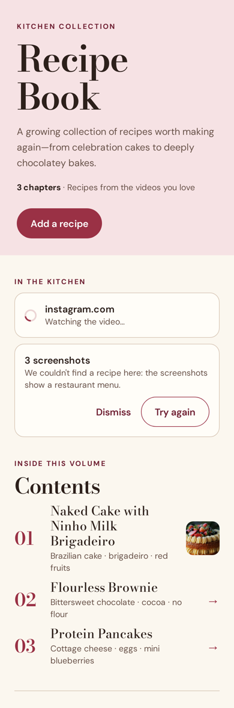
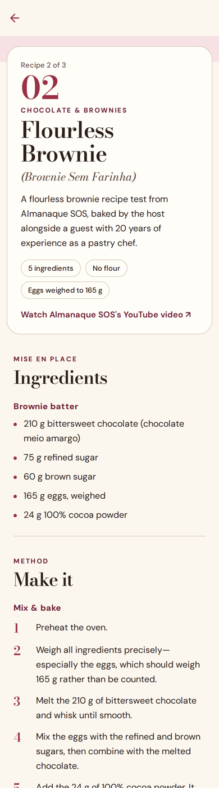

# Cookbook

Turn the cooking videos you love into your own cookbook. Paste a link from YouTube, Instagram, TikTok, or any
of the hundreds of sites [yt-dlp](https://github.com/yt-dlp/yt-dlp) supports, or add screenshots of a recipe. The app
watches the video, listens to it, reads the caption, and writes a cookbook chapter: ingredients, method, tips, and a
link back to the original.

The design follows the [Recipe Book](docs/inspiration/recipe-book.html) that inspired the project: a contents page
of numbered chapters, "Mise en place" ingredients, a numbered method, and notes.

<p>
  
  
</p>

## How it works

```
 Expo app (iOS / Android)            Supabase                          Worker (Node, Docker)
 ─────────────────────────           ────────────────────────          ──────────────────────────────────────
 Sign in with an email code  ──────▶ Auth
 Paste link / pick screenshots ────▶ imports row (queued) ◀─ claims ── claim_next_import()
   screenshots ────────────────────▶ Storage: uploads/                  yt-dlp: video, caption, subtitles
                                                                        captions, or faster-whisper speech-to-text
                                                                        ffmpeg: 8–30 evenly spaced frames
                                                                        Claude: transcript + caption + frames
                                                                                → structured recipe JSON
 Live progress (Realtime)  ◀──────── imports.progress / status ◀─────── progress updates
 Contents & recipe pages   ◀──────── recipes rows, Storage: covers/ ◀── recipe rows + cover image
```

- **`app/`**: Expo (SDK 57) app built with Expo Router. Screens are in `app/src/app/`.
- **`worker/`**: Node worker that takes imports off the queue. `src/video.ts` downloads the video and pulls
  transcript and frames, `src/extract.ts` calls Claude, and `src/recipe-schema.ts` defines the recipe format.
- **`supabase/migrations/`**: tables, row level security, the job queue function, and storage buckets.

Claude gets the transcript, the caption (creators often put the quantities there), and frames from the video (for
quantities shown on screen). It returns the recipe through structured outputs, so the result always matches the
schema. It translates recipes into the cookbook's language and keeps the original dish name. Where the video leaves
something out, it fills the gap and says so in a note. A video that teaches several dishes becomes several chapters.

## Setup

You need a [Supabase](https://supabase.com) project, a [Claude API key](https://platform.claude.com), and
somewhere to run a Docker container.

### 1. Database

```sh
npx supabase init        # creates supabase/config.toml; keep the existing migrations
npx supabase link --project-ref <your-project-ref>
npx supabase db push
```

In the Supabase dashboard, open **Authentication → Email Templates → Magic Link** and include `{{ .Token }}` in the
template, so sign-in emails contain the 6-digit code the app asks for.

### 2. Worker

```sh
cd worker
cp .env.example .env   # fill in SUPABASE_URL, SUPABASE_SERVICE_ROLE_KEY, ANTHROPIC_API_KEY
docker build -t cookbook-worker .
docker run --env-file .env cookbook-worker
```

For local development without Docker, install `ffmpeg`, then `pip install yt-dlp faster-whisper`, then run
`npm install && npm run dev`. Keep yt-dlp up to date (`pip install -U yt-dlp`), because sites change often. Some
Instagram and TikTok posts need a login: export cookies from a browser and set `YTDLP_COOKIES_FILE`.

### 3. App

```sh
cd app
cp .env.example .env   # fill in EXPO_PUBLIC_SUPABASE_URL and EXPO_PUBLIC_SUPABASE_ANON_KEY
npm install
npx expo start
```

Open it in Expo Go, or build it with `npx eas-cli@latest build`.

## Development

```sh
cd worker && npm run typecheck && npm test   # transcript parsing, frame extraction, schema
cd app && npm run typecheck
```

## Next steps

- **Share to the app**: accept links shared from Instagram or TikTok through the share sheet (for example with
  `expo-share-intent`; this needs a development build instead of Expo Go).
- **Edit recipes**: the database already allows editing `title`, `category`, `position` and `content`.
- **Settings**: a screen to rename the cookbook and choose its language (`cookbooks.language`, "English" by
  default).
- **Clean up storage**: delete cover images and screenshots when a recipe or import is removed.
- **Export**: print the cookbook or save it as a PDF, like the original Recipe Book page.
